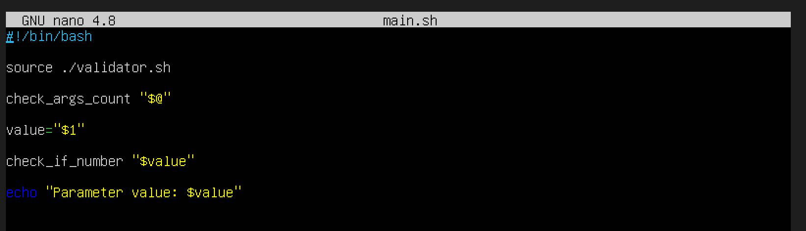
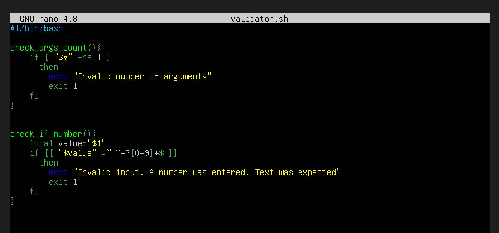
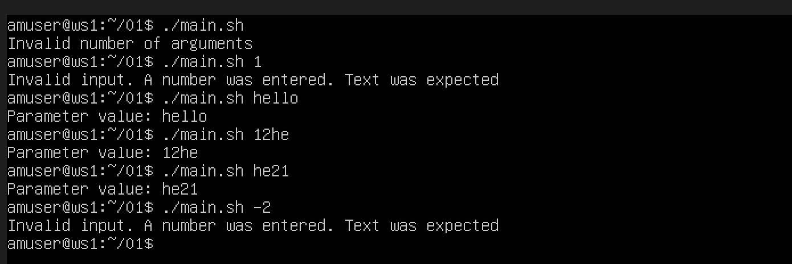
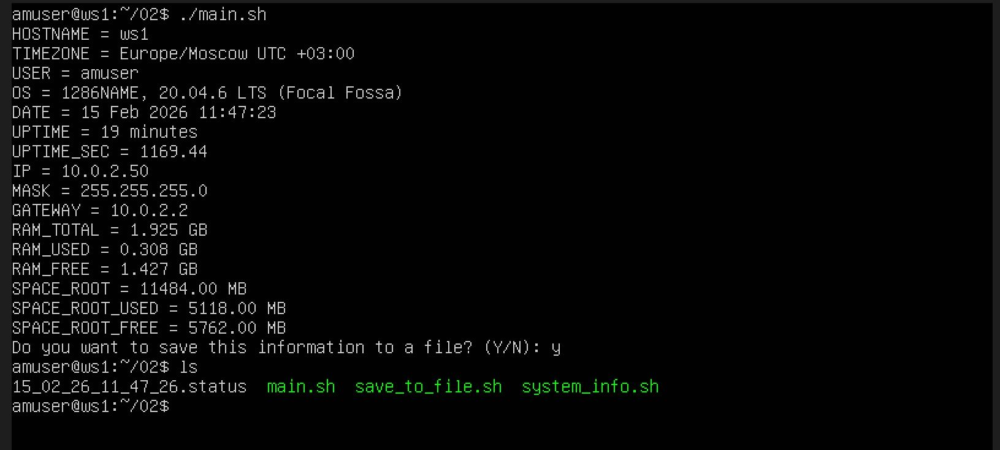
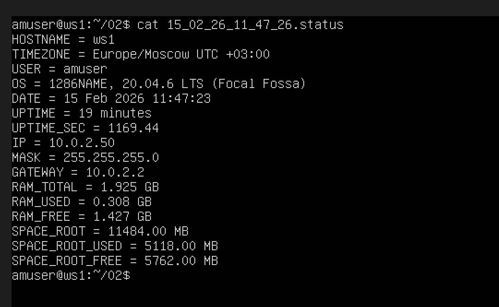
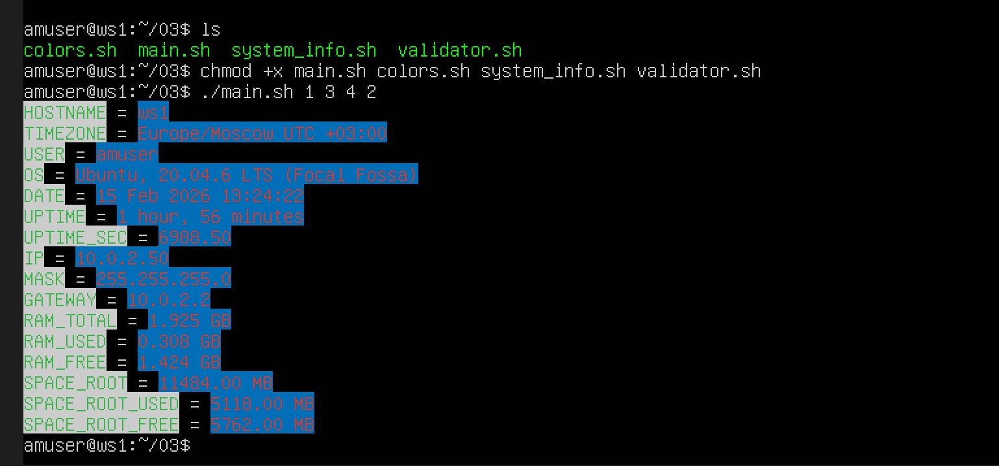
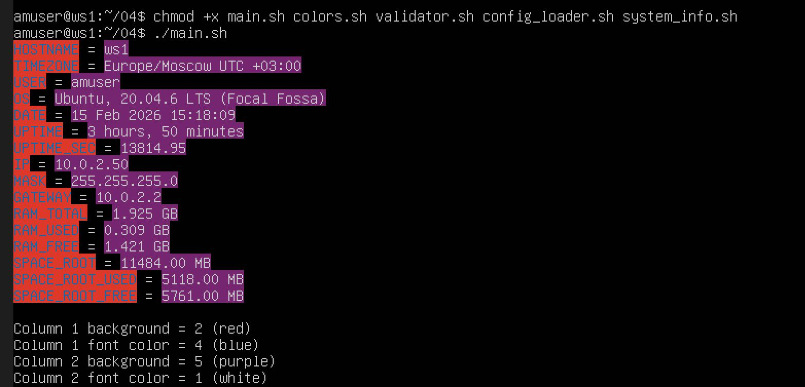
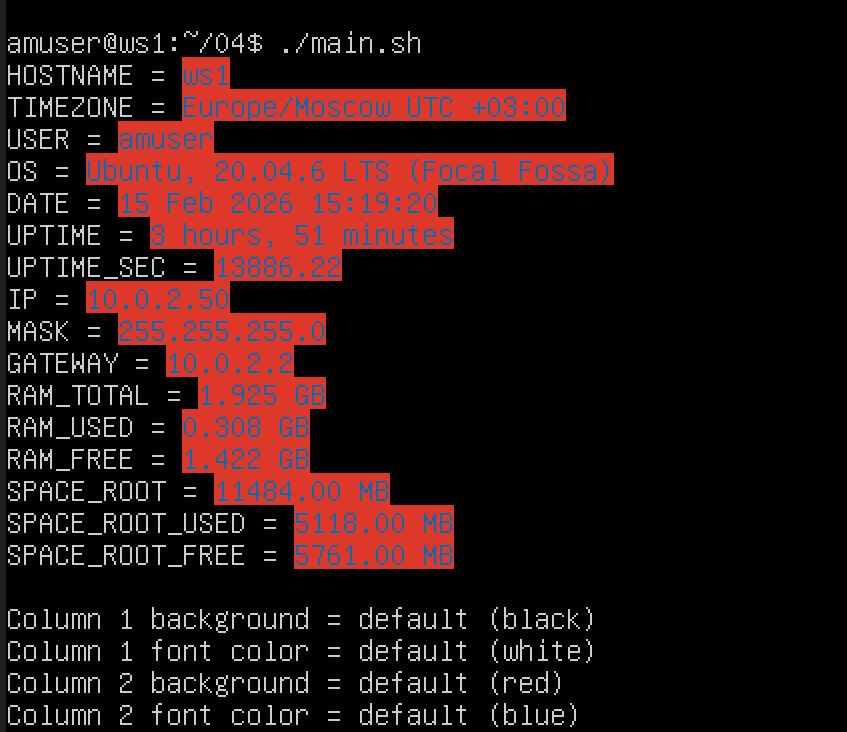
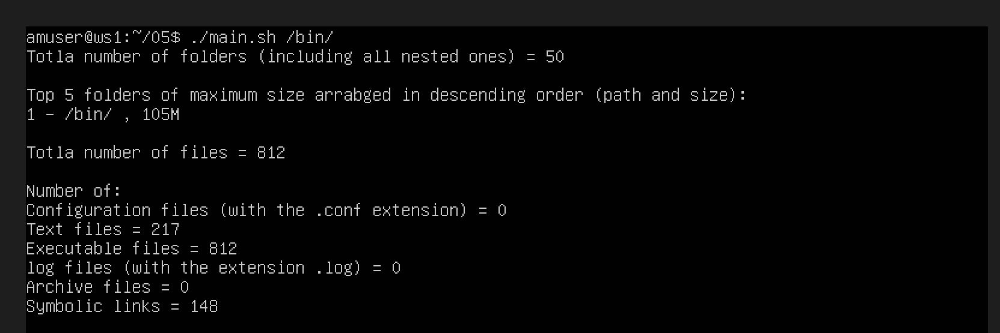
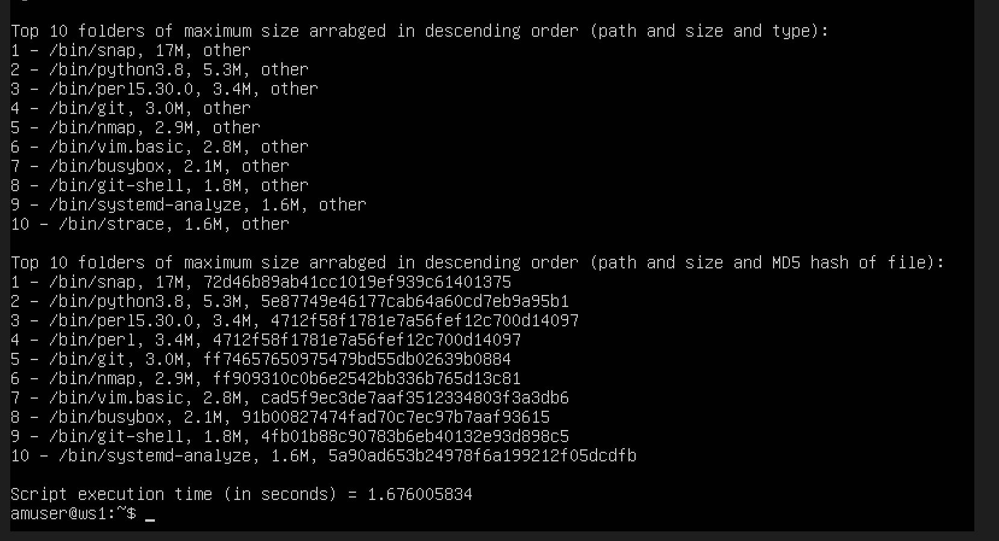

<div align="center">
  <h2>Linux Monitoring v1.0</h2>
</div>

## 📌 Навигация

- [1. Проба пера](#-1-проба-пера)
  - [Задание](#задание)
  - [Объяснение скрипта](#объяснение-скрипта)
  - [Проверка работы](#проверка-работы)
- [2. System research](#-2-system-research)
  - [Используемые команды и файлы](#используемые-команды-и-файлы)
  - [Реализация скрипта](#реализация-скрипта)
- [3. Visual output design for the system research script](#-3-visual-output-design-for-the-system-research-script)
  - [Проверка параметров запуска](#проверка-параметров-запуска)
  - [Проверка совпадения цветов](#проверка-совпадения-цветов)
  - [Реализация цветовых кодов](#реализация-цветовых-кодов)
  - [Функция цветного вывода](#функция-цветного-вывода)
  - [Главный файл main.sh](#главный-файл-mainsh-1)
  - [Пример работы скрипта цветов](#пример-работы-скрипта-цветов)
- [4. Configuring visual output design for the system research script](#-4-configuring-visual-output-design-for-the-system-research-script)
  - [Файл конфигурации](#файл-конфигурации)
  - [Значения по умолчанию](#значения-по-умолчанию)
  - [Загрузка конфигурации](#загрузка-конфигурации)
  - [Проверка корректности параметров](#проверка-корректности-параметров)
  - [Вывод цветовой схемы](#вывод-цветовой-схемы)
  - [Пример работы скрипта по умолчанию](#пример-работы-скрипта-по-умолчанию)
- [5. File system research](#-5-file-system-research)
  - [Проверка входных данных](#проверка-входных-данных)
  - [Total number of folders (including all nested ones)](#total-number-of-folders-including-all-nested-ones)
  - [TOP 5 folders of maximum size arranged in descending order (path and size)](#top-5-folders-of-maximum-size-arranged-in-descending-order-path-and-size)
  - [Total number of files](#total-number-of-files)
  - [Number of](#number-of)
  - [TOP 10 files of maximum size arranged in descending order (path, size and type)](#top-10-files-of-maximum-size-arranged-in-descending-order-path-size-and-type)
  - [TOP 10 executable files of the maximum size arranged in descending order (path, size and MD5 hash of file)](#top-10-executable-files-of-the-maximum-size-arranged-in-descending-order-path-size-and-md5-hash-of-file)
  - [Script execution time (in seconds)](#script-execution-time-in-seconds)
  - [Пример работы скрипта задачи 5](#пример-работы-скрипта-задачи-5)

## 1. Проба пера

Структура проекта:

```
src/
└── 01/
    ├── main.sh
    └── validator.sh
```

- `main.sh` — основной файл запуска.
- `validator.sh` — файл с функциями проверки.

<div align="center">
  
    
  <p><em>Cкрипт  1</em></p>
</div>

### Объяснение скрипта

- main.sh
  - `source ./validator.sh` — подключение файла с функциями.
  - `check_args_count "$@"` — проверка количества аргументов.
  - `value="$1"` — получение первого параметра.
  - `check_if_number "$value"` — проверка, является ли параметр числом.
  - `echo` — вывод значения параметра.
- validator.sh
  - `$#` — количество переданных аргументов.
  - `-ne` — not equal (не равно).
  - `local` — локальная переменная внутри функции.
  - `[[ ... =~ ... ]]` — проверка строки по регулярному выражению.
  - `^-?[0-9]+$` — проверка, является ли строка целым числом:
    - `^` — начало строки;
    - `-?` — возможный минус;
    - `[0-9]+` — одна или более цифр;
    - `$` — конец строки.
  - `exit 1` — завершение скрипта с кодом ошибки.

### Проверка работы

<div align="center">
  
  <p><em>Проверка работы скрипта  1</em></p>
</div>

---

## 2. System research

## Используемые команды и файлы

Для получения информации используются стандартные средства Linux:

- `hostname` — имя хоста
- `whoami` — текущий пользователь
- `date` — текущая дата и время
- `uptime` — время работы системы
- `df` — информация о файловой системе
- `ip`, `ifconfig` — сетевые параметры
- `awk`, `sed`, `grep` — обработка текста
- `/proc/uptime` — время работы в секундах
- `/proc/meminfo` — информация о памяти
- `/etc/os-release` — информация об ОС
- `/etc/timezone` — временная зона

---

Структура проекта:

```
src/
 └── 02/
      ├── main.sh
      ├── system_info.sh
      └── save_to_file.sh
```

---

## Реализация скрипта

#### Главный файл main.sh

```bash
#!/bin/bash

source ./system_info.sh
source ./save_to_file.sh

collect_system_info
print_system_info
ask_to_save
```

- `source` — подключает внешний файл
- `collect_system_info` — сбор данных
- `print_system_info` — вывод данных
- `ask_to_save` — сохранение в файл

---

### Получение имени хоста

```bash
HOSTNAME=$(hostname)
```

### Определение временной зоны

```bash
TIMEZONE="$(cat /etc/timezone) UTC $(date +%:z)"
```

### Информация об операционной системе

```bash
if [ -f /etc/os-release ]; then
  . /etc/os-release
  OS="$NAME, $VERSION"
fi
```

- `-f` — проверка существования файла
- `.` — загрузка переменных из файла

### Время работы системы

```bash
UPTIME=$(uptime -p | sed 's/^up //')
UPTIME_SEC=$(awk '{print $1}' /proc/uptime)
```

- sed — это потоковый текстовый редактор, который изменяет входящий текст «на лету».
- s (substitute) — команда замены.
- /^up / — шаблон поиска (регулярное выражение):
  - ^ — символ привязки к началу строки.
  - up — ищет конкретное слово «up» с последующим пробелом.
- // — пустая строка замены. Это означает, что найденный текст будет удален (заменен на «ничего»).

### Сеть

```bash
IP=$(hostname -I | awk '{print $1}')
#or ip route get 8.8.8.8 | awk '{print $7}'

MASK=$(ifconfig | grep -m1 "netmask" | awk '{print $4}')
#or ip addr show | grep inet | awk '{print $2}'

GATEWAY=$(ip route | awk '/default/ {print $3}')
```

- `-I` — вывод IP-адресов
- `grep -m1` — первое совпадение
- `/default/` — поиск строки с default

### Оперативная память

```bash
RAM_TOTAL=$(grep MemTotal /proc/meminfo | awk '{printf "%.3f GB", $2/1024/1024}')
RAM_FREE=$(awk '/MemFree/ {printf "%.3f GB", $2/1024/1024}' /proc/meminfo)
RAM_USED=$(awk '
/MemTotal/ {total=$2}
/MemAvailable/ {free=$2}
END {printf "%.3f GB", (total-free)/1024/1024}
' /proc/meminfo)
```

- `/proc/meminfo` — источник информации о памяти
- `$2/1024/1024` — перевод из KB в GB

### Корневой раздел

```bash
SPACE_ROOT=$(df -m / | tail -1 | awk 'NR==2 {printf "%.2f MB", $2}')
SPACE_ROOT_USED=$(df -m / | tail -1 | awk 'NR==2 {printf "%.2f MB", $3}')
SPACE_ROOT_FREE=$(df -m / | tail -1 | awk 'NR==2 {printf "%.2f MB", $4}')
```

- `df -m` — вывод в мегабайтах
- `tail -1` — последняя строка
- `$2 $3 $4` — total, used, free

---

## Пример работы скрипта

<div align="center">
  
  <p><em>Вывод информации о системе</em></p>
</div>

---

## Сохранение данных в файл

После вывода информации пользователю предлагается сохранить результат:

```bash
echo -n "Do you want to save this information to a file? (Y/N): "
read answer

if [[ "$answer" == "Y" || "$answer" == "y" ]]; then
  FILENAME=$(date +"%d_%m_%y_%H_%M_%S").status
  {
    echo "HOSTNAME = $HOSTNAME"
    echo "TIMEZONE = $TIMEZONE"
    echo "USER = $USER"
    echo "OS = $OS"
    echo "DATE = $DATE"
    echo "UPTIME = $UPTIME"
    echo "UPTIME_SEC = $UPTIME_SEC"
    echo "IP = $IP"
    echo "MASK = $MASK"
    echo "GATEWAY = $GATEWAY"
    echo "RAM_TOTAL = $RAM_TOTAL"
    echo "RAM_USED = $RAM_USED"
    echo "RAM_FREE = $RAM_FREE"
    echo "SPACE_ROOT = $SPACE_ROOT"
    echo "SPACE_ROOT_USED = $SPACE_ROOT_USED"
    echo "SPACE_ROOT_FREE = $SPACE_ROOT_FREE"
  } > "$FILENAME"
fi
```

- `date +"%d_%m_%y_%H_%M_%S"` — формирование имени файла
- `> "$FILENAME"` — перенаправление вывода в файл

Файл создаётся в текущей директории и содержит полный вывод системной информации.

<div align="center">
  
  <p><em>Сохранение данных в файл</em></p>
</div>

---

## 3. Visual output design for the system research script

Структура проекта:

```bash
src/
└── 03/
    ├── main.sh
    ├── validator.sh
    ├── colors.sh
    └── system_info.sh
```

### Проверка параметров запуска

Проверка количества аргументов выполняется в `validator.sh`.

```bash
check_args_count() {
    if [ "$#" -ne 4 ]; then
        echo "Error: You must enter 4 parameters"
        echo "Example: ./main.sh 1 3 4 5"
        exit 1
    fi
}
```

Далее проверяется диапазон значений:

```bash
check_range() {
    for param in "$@"
    do
        if ! [[ "$param" =~ ^[1-6]$ ]]; then
            echo "Error: Parameters must be numbers from 1 to 6"
            exit 1
        fi
    done
}
```

---

### Проверка совпадения цветов

По заданию цвет фона и текста внутри одной колонки не должны совпадать.

Проверка реализована так:

```bash
check_equal_colors() {
    if [ "$1" -eq "$2" ] || [ "$3" -eq "$4" ]; then
        echo "Error: Font and background colours must not match in one column"
        echo "Please run the script again with different parameters"
        exit 1
    fi
}
```

---

### Реализация цветовых кодов

Для перевода номеров 1–6 в ANSI-коды используются две функции:

```bash

get_font_color() {
case $1 in
  1) echo 37 ;; # white
  2) echo 31 ;; # red
  3) echo 32 ;; # green
  4) echo 34 ;; # blue
  5) echo 35 ;; # purple
  6) echo 30 ;; # black
esac
}

get_bg_color() {
case $1 in
  1) echo 47 ;; # white
  2) echo 41 ;; # red
  3) echo 42 ;; # green
  4) echo 44 ;; # blue
  5) echo 45 ;; # purple
  6) echo 40 ;; # black
esac
}
```

После этого формируются переменные:

```bash
NAME_BG=$(get_bg_color $1)
NAME_FG=$(get_font_color $2)
VALUE_BG=$(get_bg_color $3)
VALUE_FG=$(get_font_color $4)
```

---

### Функция цветного вывода

Цветной вывод реализован через ANSI-последовательность В `system_info.sh`.

```bash
print_line() {
    echo -e "\033[${NAME_BG};${NAME_FG}m$1\033[0m = \033[${VALUE_BG};${VALUE_FG}m$2\033[0m"
}
```

Структура ANSI-кода:

```
\033[<background>;<foreground>m
```

- `\033` — escape-последовательность
- `[background;foreground]` — коды цветов
- `m` — начало форматирования
- `\033[0m` — сброс форматирования

Сброс необходим, чтобы цвет не применялся к следующему тексту терминала.

---

- `\033` — escape-код;
- `m` — завершение ANSI-последовательности;
- `\033[0m` — сброс форматирования.

Сброс необходим для того, чтобы цвет не распространялся на последующий текст терминала.

---

### Главный файл main.sh

Главный файл подключает остальные модули и запускает проверки.

```bash
#!/bin/bash

source ./validator.sh
source ./colors.sh
source ./system_info.sh

check_args_count "$@"
check_range "$@"
check_equal_colors "$@"

NAME_BG=$(get_bg_color "$1")
NAME_FG=$(get_font_color "$2")
VALUE_BG=$(get_bg_color "$3")
VALUE_FG=$(get_font_color "$4")
RESET="\033[0m"

print_system_info
```

---

### Пример работы скрипта цветов

<div align="center">
  
  <p><em>Цветной вывод системной информации</em></p>
</div>

---

## 4. Configuring visual output design for the system research script

```bash
src/
└── 04/
    ├── main.sh
    ├── config.conf
    ├── config_loader.sh
    ├── validator.sh
    ├── colors.sh
    └── system_info.sh
```

### Файл конфигурации

Файл `config.conf` имеет следующий формат:

```bash
column1_background=2
column1_font_color=4
column2_background=5
column2_font_color=1
```

Где:

| Значение | Цвет   |
| -------- | ------ |
| 1        | white  |
| 2        | red    |
| 3        | green  |
| 4        | blue   |
| 5        | purple |
| 6        | black  |

---

### Значения по умолчанию

Если параметры отсутствуют в `config.conf`, используются следующие значения:

```bash
DEFAULT_COLUMN1_BG=6
DEFAULT_COLUMN1_FG=1
DEFAULT_COLUMN2_BG=2
DEFAULT_COLUMN2_FG=4
```

Что соответствует:

- Column 1 background — black
- Column 1 font color — white
- Column 2 background — red
- Column 2 font color — blue

---

### Загрузка конфигурации

В начале скрипта проверяется наличие файла:

```bash
CONFIG_FILE="config.conf"

if [ -f "$CONFIG_FILE" ]; then
    source "$CONFIG_FILE"
fi
```

Команда `source` загружает переменные из конфигурационного файла в текущую среду выполнения скрипта.

---

### Подстановка значений по умолчанию

Если переменная отсутствует, используется механизм подстановки:

```bash
column1_background=${column1_background:-$DEFAULT_COLUMN1_BG}
column1_font_color=${column1_font_color:-$DEFAULT_COLUMN1_FG}
column2_background=${column2_background:-$DEFAULT_COLUMN2_BG}
column2_font_color=${column2_font_color:-$DEFAULT_COLUMN2_FG}
```

Конструкция:

```bash
${variable:-default}
```

означает: если `variable` пустая или не определена — использовать `default`.

---

### Проверка корректности параметров

Все параметры должны быть числами от 1 до 6:

```bash
for param in $column1_background $column1_font_color $column2_background $column2_font_color
do
    if ! [[ "$param" =~ ^[1-6]$ ]]; then
        echo "Error: Config values must be numbers from 1 to 6"
        exit 1
    fi
done
```

Дополнительно проверяется, чтобы цвет фона и текста внутри одной колонки не совпадали:

```bash
if [ "$column1_background" -eq "$column1_font_color" ] || \
   [ "$column2_background" -eq "$column2_font_color" ]; then
    echo "Error: Font and background colours must not match in one column."
    exit 1
fi
```

---

### Вывод цветовой схемы

После вывода системной информации добавляется пустая строка и выводится используемая цветовая схема:

```bash
echo

echo "Column 1 background = $column1_background ($(color_name $column1_background))"
echo "Column 1 font color = $column1_font_color ($(color_name $column1_font_color))"
echo "Column 2 background = $column2_background ($(color_name $column2_background))"
echo "Column 2 font color = $column2_font_color ($(color_name $column2_font_color))"
```

Если используется значение по умолчанию, выводится:

```
Column 1 background = default (black)
```

---

### Пример работы скрипта по умолчанию

<div align="center">
  
  
  <p><em>Работа скрипта с конфигурационным файлом</em></p>
</div>

---

## 5. File system research

```bash
src/
└── 05/
    ├── main.sh
    └── functions.sh
```

### Проверка входных данных

Скрипт принимает один параметр — путь к директории.

```bash
if [ "$#" -ne 1 ]
```

- `$#` — количество аргументов
- `-ne` — not equal

```bash
if [[ ! -d "$DIR" ]]
```

- `-d` — проверка существования директории

```bash
if [[ "${DIR: -1}" != "/" ]]
```

- `${DIR: -1}` — последний символ строки

---

### Total number of folders (including all nested ones)

```bash
TOTAL_FOLDERS=$(ls -lR "$DIR" 2>/dev/null | grep -c "^d")
```

Объяснение:

- `ls`
  - `-l` — подробный вывод
  - `-R` — рекурсивный обход
- `grep`
  - `-c` — подсчёт совпадений
  - `"^d"` — строки, начинающиеся с d (директории)
- `2>/dev/null` — скрытие ошибок доступа

---

### TOP 5 folders of maximum size arranged in descending order (path and size)

```bash
du -h --max-depth=1 "$DIR" 2>/dev/null | sort -rh | head -n 5 | awk '{print NR " - " $2 ", " $1}'
```

Объяснение:

- `du` — disk usage
- `-h` — human readable
- `--max-depth=1` — только верхний уровень
- `sort`
  - `-r` — reverse (по убыванию)
  - `-h` — сортировка с учётом размеров
- `head -n 5` — первые 5 строк
- `awk` — форматирование вывода

---

### Total number of files

```bash
TOTAL_FILES=$(find "$DIR" -type f 2>/dev/null | wc -l)
```

Объяснение:

- `find`
- `-type f` — обычные файлы
- `wc -l` — подсчёт строк

---

### Number of

```bash
CONF_FILES=$(find "$DIR" -type f -name "*.conf" 2>/dev/null | wc -l)
TEXT_FILES=$(find "$DIR" -type f -exec file {} \; 2>/dev/null | grep -i text | wc -l)
EXEC_FILES=$(find "$DIR" -type f -executable 2>/dev/null | wc -l)
LOG_FILES=$(find "$DIR" -type f -name "*.log" 2>/dev/null | wc -l)
ARCH_FILES=$(find "$DIR" -type f \( -name "*.zip" -o -name "*.tar" -o -name "*.gz" -o -name "*.rar" \) 2>/dev/null | wc -l)
SYM_LINKS=$(find "$DIR" -type l 2>/dev/null | wc -l)
```

Объяснение ключей:

- `-type f` — файлы
- `-type l` — символические ссылки
- `-name` — поиск по маске
- `-exec file {}` — определение типа файла
- `-executable` — исполняемые файлы
- `-o` — логическое ИЛИ

---

### TOP 10 files of maximum size arranged in descending order (path, size and type)

```bash
find "$DIR" -type f -exec du -h {} + 2>/dev/null \
| sort -rh \
| head -10 \
| while read size filepath
do
    FILE_TYPE=$(get_file_type "$filepath")
    echo "$filepath, $size, $FILE_TYPE"
done
```

Объяснение:

- `du -h` — размер файла
- `{}` — текущий файл
- `+` — групповой запуск
- `while read` — чтение строки
- `get_file_type` — функция определения типа

---

### TOP 10 executable files of the maximum size arranged in descending order (path, size and MD5 hash of file)

```bash
find "$DIR" -type f -executable 2>/dev/null \
| xargs -I {} du -h "{}" 2>/dev/null \
| sort -rh \
| head -10 \
| while read size filepath
do
    HASH=$(md5sum "$filepath" | awk '{print $1}')
    echo "$filepath, $size, $HASH"
done
```

Объяснение:

- `-executable` — только исполняемые файлы
- `xargs` — для преобразования входных данных в строку аргументов
  - `-I {}` — подстановка аргумента
- `du -h` — размер файла
- `md5sum` — вычисление MD5
- `awk '{print $1}'` — вывод только хеша
- `sort -rh` — сортировка по убыванию

---

### Script execution time (in seconds)

```bash
START_TIME=$(date +%s.%N)
END_TIME=$(date +%s.%N)
EXEC_TIME=$(echo "$END_TIME - $START_TIME" | bc)
```

Объяснение:

- `date +%s.%N` — время в секундах с наносекундами
- `bc` — калькулятор для вычислений

---

### Пример работы скрипта задачи 5

<div align="center">
  
  
  <p><em>Работа скрипта задачи 5</em></p>
</div>

---
