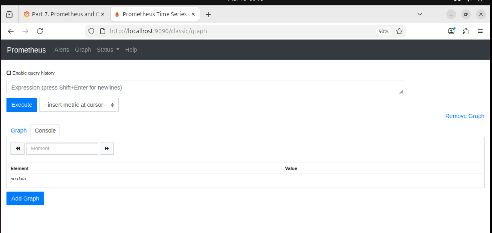
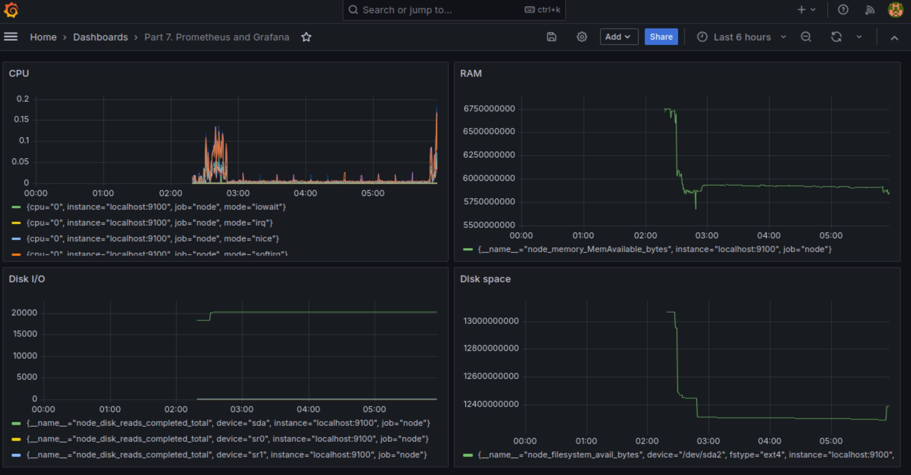
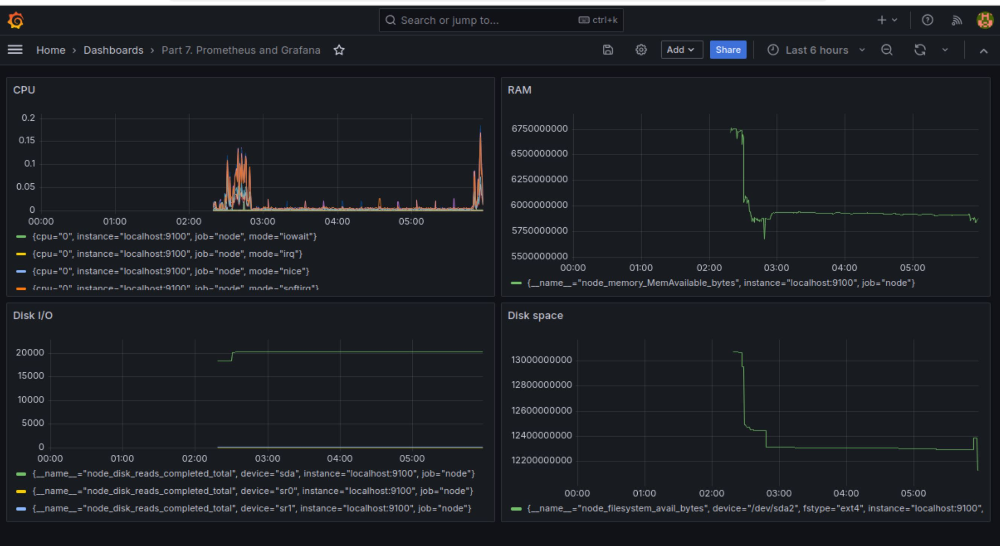
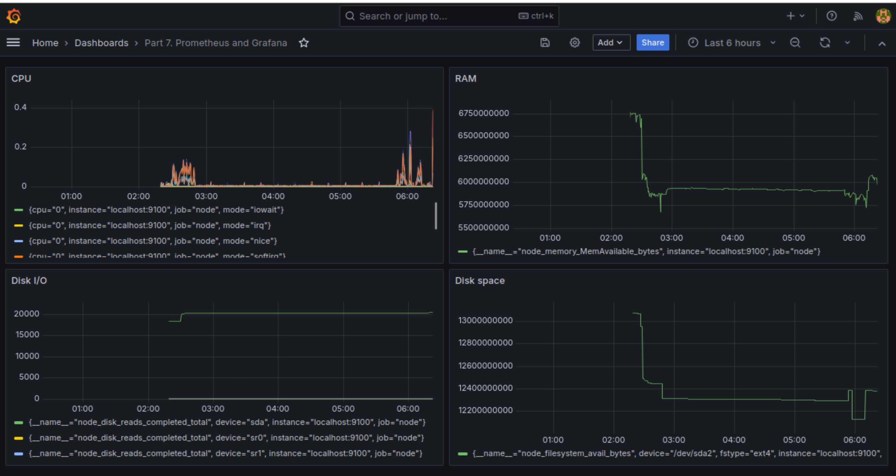
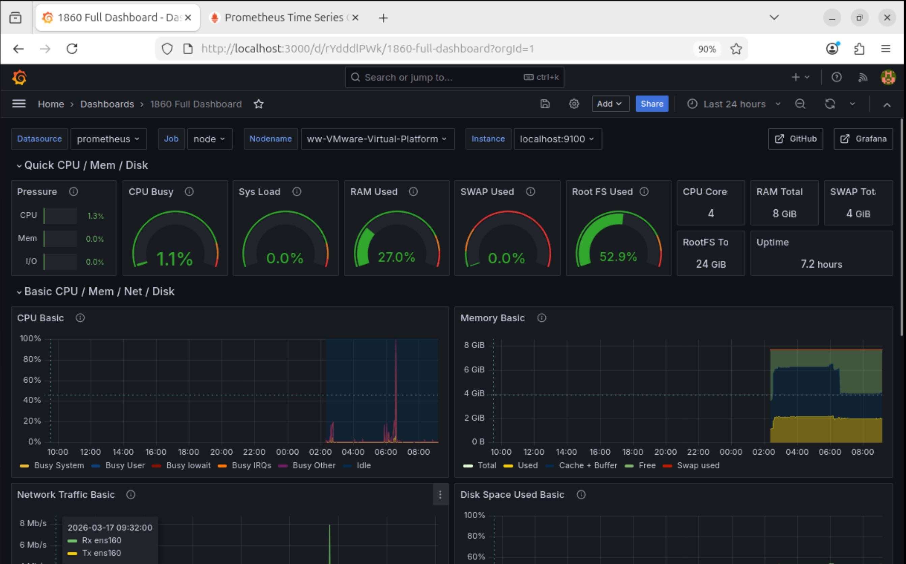
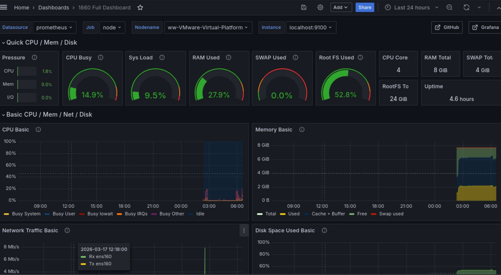
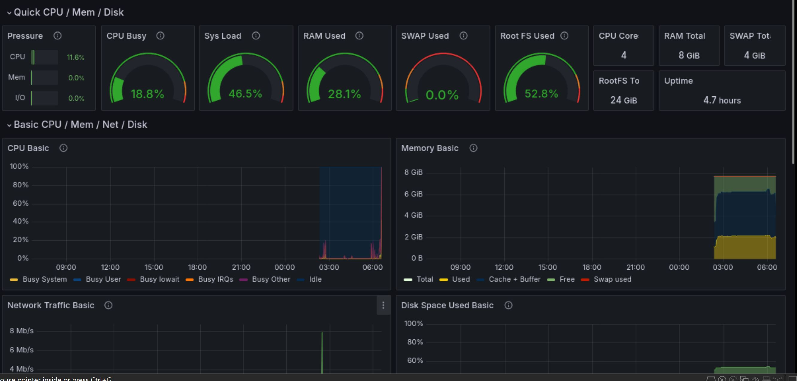
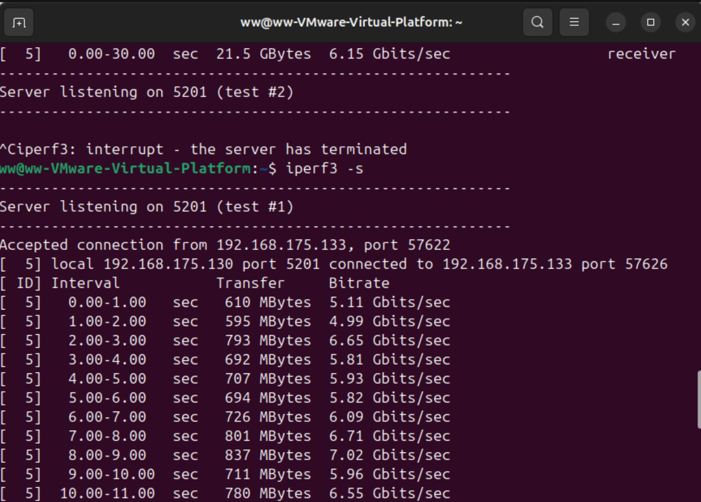
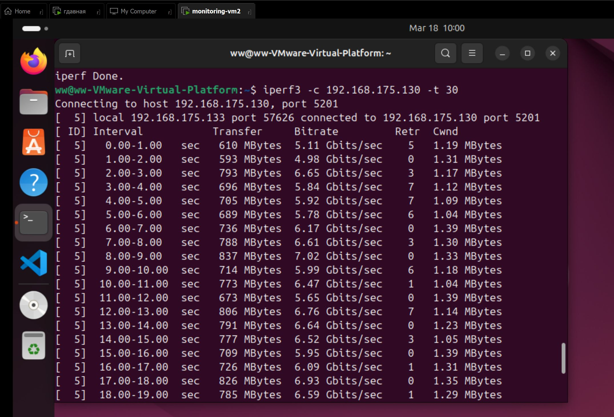
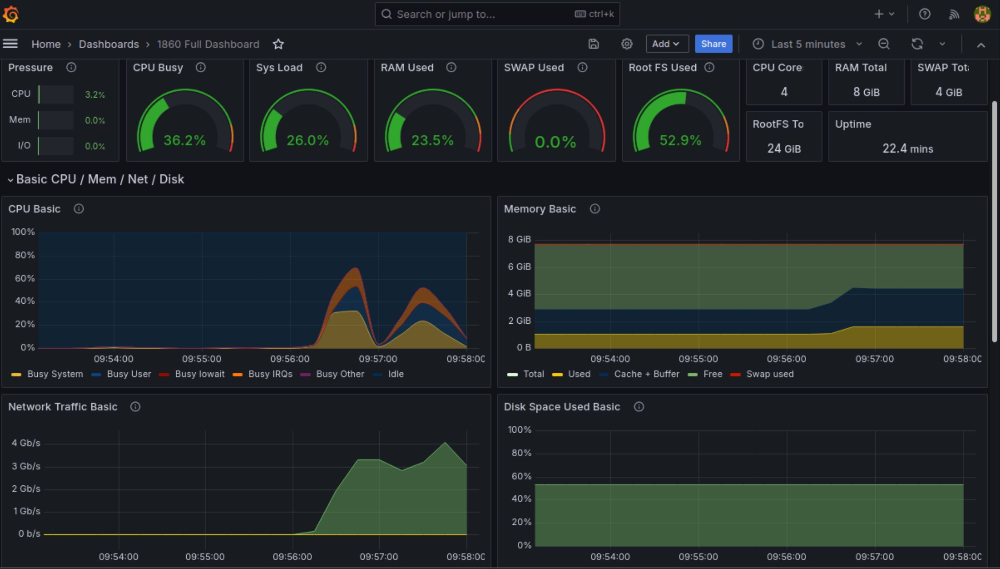

<div align="center">
  <h2>Linux Monitoring v2.0</h2>
</div>

## 📌 Навигация

- [1 Генератор файлов](#-1-генератор-файлов)
- [2 Засорение файловой системы](#-2-засорение-файловой-системы)
- [3 Очистка файловой системы](#-3-очистка-файловой-системы)
- [4 Генератор логов](#-4-генератор-логов)
- [5 Мониторинг](#-5-мониторинг)
- [6 GoAccess](#-6-goaccess)
- [7. Prometheus and Grafana](#-7-prometheus-and-grafana)
  - [Установка Prometheus](#установка-prometheus)
  - [Установка Grafana](#установка-grafana)
  - [Настройка Grafana](#настройка-grafana)
  - [Проверка нагрузки системы](#проверка-нагрузки-системы)
- [8. A ready-made dashboard](#-8-a-ready-made-dashboard)
  - [Импорт dashboard](#импорт-dashboard)
  - [Проверка нагрузки диска](#проверка-нагрузки-диска)
  - [Проверка нагрузки CPU и RAM](#проверка-нагрузки-cpu-и-ram)
  - [Проверка сетевой нагрузки](#проверка-сетевой-нагрузки)
- [9. Bonus. Your own node_exporter](#-9-bonus-your-own-node_exporter)

---

## 1 Генератор файлов

---

```
src/
└── 01/
    ├── main.sh
    ├── validator.sh
    └── generator.sh
```

---

<details>

<summary><b> main.sh </b></summary>

```bash

#!/bin/bash

source validator.sh
source generator.sh

validate_params "$@"

BASE_PATH=$1
FOLDER_COUNT=$2
FOLDER_LETTERS=$3
FILES_COUNT=$4
FILE_PATTERN=$5
FILE_SIZE=$6

generate_structure "$BASE_PATH" "$FOLDER_COUNT" "$FOLDER_LETTERS" "$FILES_COUNT" "$FILE_PATTERN" "$FILE_SIZE"

```

</details>

<details> <summary><b> validator.sh </b></summary>

```bash

#!/bin/bash

validate_params(){
if [[ $# -ne 6 ]]
    then
      echo "Invalid number of arguments."
      exit 1
fi

local path=$1
local folder_count=$2
local folder_letters=$3
local files_count=$4
local file_pattern=$5
local file_size=$6

    if [[ ! -e "$path" ]]; then
        echo "Error: Path does not exist"
        exit 1
    fi

    if [[ ! $path =~ ^/ ]]; then
        echo "Error: Path must be absolute"
        exit 1
    fi

    if [[ ! $folder_count =~ ^[0-9]+$ ]]; then
        echo "Error: Folder count must be a number"
        exit 1
    fi

    if [[ ! $files_count =~ ^[0-9]+$ ]]; then
        echo "Error: Files count must be a number"
        exit 1
    fi

    if [[ ! $folder_letters =~ ^[a-zA-Z]{1,7}$ ]]; then
        echo "Error: Folder letters must contain only letters (max 7)"
        exit 1
    fi

    if [[ ! $file_pattern =~ ^[a-zA-Z]{1,7}\.[a-zA-Z]{1,3}$ ]]; then
        echo "Error: File pattern must be name.ext"
        exit 1
    fi

    if [[ ! $file_size =~ ^[0-9]+kb$ ]]; then
        echo "Error: File size must be like 10kb"
        exit 1
    fi

    local size=${file_size%kb}

    if (( size > 100 )); then
        echo "Error: File size must be <= 100kb"
        exit 1
    fi
}

```

</details>

**Разбор синтаксиса**

- `$#` — количество аргументов переданных скрипту
- `[[ condition ]]` — расширенный синтаксис условного оператора bash
- `-ne` — оператор сравнения "не равно"
- `=~` — проверка строки по регулярному выражению
- `^` — начало строки в регулярном выражении
- `$` — конец строки
- `[0-9]+` — проверка что строка состоит из цифр
- `[a-zA-Z]{1,7}` — допускается от 1 до 7 букв
- `[a-zA-Z]{1,7}\.[a-zA-Z]{1,3}` — проверка шаблона `name.ext`
- `${file_size%kb}` — удаляет суффикс `kb` из строки
- `(( ))` — арифметическое выражение bash
- `exit 1` — завершает скрипт с кодом ошибки

<details> 
<summary><b> generator.sh </b></summary>

```bash
#!/bin/bash

generate_name() {

    local letters=$1
    local index=$2
    local date=$(date +%d%m%y)

    local name=""

    for ((i=0;i<index+4;i++))
    do
        name+=${letters:0:1}
    done

    name=${name:0:-1}${letters: -1}

    echo "${name}_${date}"
}

check_disk_space() {

    local free=$(df / --output=avail | tail -1)

    if (( free < 1048576 )); then
        echo "Less than 1GB free space. Script stopped."
        exit 1
    fi
}

write_log() {

    local path=$1
    local size=$2
    local log_file=$3

    echo "$path $(date '+%d.%m.%y') $size" >> "$log_file"
}

generate_structure() {

    local base_path=$1
    local folder_count=$2
    local folder_letters=$3
    local files_count=$4
    local file_pattern=$5
    local file_size=$6

    local name_letters=${file_pattern%.*}
    local ext_letters=${file_pattern#*.}

    local size=${file_size%kb}

    local log_file="$base_path/generator.log"

    mkdir -p "$base_path"

    for (( i=1; i<=folder_count; i++ ))
    do

        check_disk_space

        folder_name=$(generate_name "$folder_letters" "$i")
        folder_path="$base_path/$folder_name"

        mkdir -p "$folder_path"

        write_log "$folder_path" "-" "$log_file"

        for (( j=1; j<=files_count; j++ ))
        do

            check_disk_space

            file_name=$(generate_name "$name_letters" "$j")
	    ext="$ext_letters"

	    while [[ ${#ext} -lt 3 ]]
	        do
	            ext="${ext_letters:0:1}$ext"
	        done

            file_path="$folder_path/${file_name}.${ext}"

            truncate -s "${size}K" "$file_path"

            write_log "$file_path" "$file_size" "$log_file"

        done

    done
}


```

</details>

**Разбор синтаксиса**

- `local` — объявление локальной переменной внутри функции
- `date +%d%m%y` — получение текущей даты в формате `DDMMYY`
- `for (( i=... ))` — арифметический цикл bash
- `${letters:0:1}` — получение первого символа строки
- `${letters: -1}` — получение последнего символа строки
- `${#ext}` — длина строки
- `${file_pattern%.*}` — получение имени файла без расширения
- `${file_pattern#*.}` — получение расширения файла
- `mkdir -p` — создание директории вместе с родительскими
- `truncate -s` — создание файла указанного размера
- `df / --output=avail` — получение свободного места на разделе `/`
- `tail -1` — взять последнюю строку вывода
- `>>` — добавление строки в конец файла

---

[Навигация](#-навигация)

---

## 2 Засорение файловой системы

### Работа скрипта

Во время выполнения скрипт должен:

- создавать папки в **различных директориях файловой системы**;
- создавать в этих папках **случайное количество файлов**;
- проверять свободное место на разделе `/`.

Выполнение скрипта должно **остановиться**, если свободное место  
на файловой системе становится меньше **1GB**.

---

### Логирование

Во время работы скрипт должен создавать **лог файл**, содержащий информацию обо всех созданных объектах:

- полный путь к файлу или папке
- дату создания
- размер файла

Также в лог файл должна записываться информация о работе скрипта:

- время начала выполнения
- время окончания выполнения
- общее время работы скрипта

---

```
src/
└── 02/
    ├── main.sh
    ├── validator.sh
    └── generator.sh
```

---

<details>
<summary><b> main.sh </b></summary>

```bash

#!/bin/bash

source ./validator.sh
source ./generator.sh

validate_params "$@"

FOLDER_LETTERS=$1
FILE_PATTERN=$2
FILE_SIZE=$3

LOG_FILE="/tmp/clogging_log.txt"

> "$LOG_FILE"

START_TIME=$(date +%s)
START_HUMAN=$(date '+%Y-%m-%d %H:%M:%S')

generate_structure "$FOLDER_LETTERS" "$FILE_PATTERN" "$FILE_SIZE"

END_TIME=$(date +%s)
END_HUMAN=$(date '+%Y-%m-%d %H:%M:%S')

DURATION=$((END_TIME - START_TIME))

echo "Start time: $START_HUMAN" >> "$LOG_FILE"
echo "End time: $END_HUMAN" >> "$LOG_FILE"
echo "Execution time: ${DURATION}s" >> "$LOG_FILE"


```

</details>

**Разбор синтаксиса**

- `source` — подключение другого bash файла
- `$@` — передача всех аргументов функции
- `date` — получение текущего времени
- `$( )` — выполнение команды внутри переменной
- `> file` — очистка файла
- `>> file` — добавление строки в файл

---

<details>
<summary><b> validator.sh </b></summary>

```bash

#!/bin/bash

validate_params(){

if [[ $# -ne 3 ]]
then
echo "Invalid number of arguments."
exit 1
fi

local folder_letters=$1
local file_pattern=$2
local file_size=$3

if [[ ! $folder_letters =~ ^[a-zA-Z]{1,7}$ ]]
then
echo "Error: Folder letters must contain only letters"
exit 1
fi

if [[ ! $file_pattern =~ ^[a-zA-Z]{1,7}\.[a-zA-Z]{1,3}$ ]]
then
echo "Error: File pattern must be name.ext"
exit 1
fi

if [[ ! $file_size =~ ^[0-9]+Mb$ ]]
then
echo "Error: File size must be like 10Mb"
exit 1
fi

local size=${file_size%Mb}

if (( size > 100 ))
then
echo "Error: File size must be <= 100Mb"
exit 1
fi

}


```

</details>

**Разбор синтаксиса**

- `$#` — количество аргументов скрипта
- `[[ ]]` — условный оператор bash
- `=~` — проверка регулярного выражения
- `[a-zA-Z]{1,7}` — допускается от 1 до 7 букв
- `${var%pattern}` — удаление части строки справа
- `exit 1` — завершение скрипта с ошибкой

---

<details>
<summary><b> generator.sh </b></summary>

```bash

#!/bin/bash

generate_name() {

    local letters=$1
    local index=$2
    local date=$(date +%d%m%y)

    local name=""

    for ((i=0;i<index+4;i++))
    do
        name+=${letters:0:1}
    done

    name=${name:0:-1}${letters: -1}

    echo "${name}_${date}"
}

check_disk_space() {

    local free=$(df / --output=avail | tail -1)

    if (( free < 1048576 )); then
        echo "Less than 1GB free space. Script stopped."
        exit 1
    fi
}

write_log() {

    local path=$1
    local size=$2
    local log_file=$3

    echo "$path $(date '+%d.%m.%y') $size" >> "$log_file"
}

generate_structure(){

local folder_letters=$1
local file_pattern=$2
local file_size=$3

local name_letters=${file_pattern%.*}
local ext_letters=${file_pattern#*.}

local size=${file_size%Mb}

local LOG_FILE="/tmp/clogging_log.txt"

PATHS=(
"/tmp"
"/var/tmp"
"$HOME"
)

for base in "${PATHS[@]}"
do

DEPTH=$((RANDOM % 10 + 1))

CURRENT_PATH="$base"

for (( i=1;i<=DEPTH;i++ ))
do

check_disk_space

folder_name=$(generate_name "$folder_letters" "$i")

CURRENT_PATH="$CURRENT_PATH/$folder_name"

mkdir -p "$CURRENT_PATH"

write_log "$CURRENT_PATH" "-" "$LOG_FILE"

FILES=$((RANDOM % 10 + 1))

for (( j=1;j<=FILES;j++ ))
do

check_disk_space

file_name=$(generate_name "$name_letters" "$j")

ext="$ext_letters"

while [[ ${#ext} -lt 3 ]]
do
ext="${ext_letters:0:1}$ext"
done

file_path="$CURRENT_PATH/${file_name}.${ext}"

dd if=/dev/zero of="$file_path" bs=1M count="$size" status=none

write_log "$file_path" "$file_size" "$LOG_FILE"

done

done

done

}


```

</details>

**Разбор синтаксиса**

- `local` — локальная переменная внутри функции
- `${var:0:1}` — получение первого символа строки
- `${#var}` — длина строки
- `${var%.*}` — имя файла без расширения
- `${var#*.}` — расширение файла
- `for (( ))` — арифметический цикл bash
- `mkdir -p` — создание директории
- `dd` — создание файла заданного размера
- `df` — проверка свободного места на диске
- `>>` — добавление строки в файл

---

[Навигация](#-навигация)

---

## 3 Очистка файловой системы

### Режимы работы

**1 — Очистка по лог файлу**

Удаляются все файлы и папки, которые были записаны в лог файл при выполнении скрипта из ** 2**.

---

**2 — Очистка по времени создания**

Пользователь вводит:

- начальное время
- конечное время

Все файлы и папки, созданные **в указанный временной интервал**, будут удалены.

Формат времени:

YYYY-MM-DD HH:MM

Пример:

2026-03-14 12:40  
2026-03-14 12:50

---

**3 — Очистка по маске имени**

Удаляются все файлы и папки, имена которых соответствуют маске:

\*\_DDMMYY

где **DDMMYY** — дата создания объектов.

Пример:

\*\_140326

---

### Требования

Скрипт должен:

- удалять все файлы и папки, созданные в ** 2**
- поддерживать **три режима очистки**
- проверять корректность входных параметров
- работать безопасно и не удалять системные файлы

После выполнения скрипта удалённые файлы и папки **не должны отображаться** при выполнении команд:

find / -type f -name "_\_DDMMYY._"  
find / -type d -name "\*\_DDMMYY"

---

```
src/
└── 03/
    ├── main.sh
    ├── validator.sh
    └── cleaner.sh
```

---

<details>
<summary><b> main.sh </b></summary>

```bash

#!/bin/bash

source ./validator.sh
source ./cleaner.sh

validate_params "$@"

MODE=$1

case $MODE in

1)
clean_by_log
;;

2)
clean_by_time
;;

3)
clean_by_mask
;;

esac

```

</details>

**Разбор синтаксиса**

- `source` — подключение других bash файлов
- `$@` — передача всех аргументов функции
- `case` — оператор выбора в bash
- `;;` — завершение блока case

---

<details>
<summary><b> validator.sh </b></summary>

```bash

#!/bin/bash

validate_params() {

if [[ $# -ne 1 ]]
then
    echo "Error: script requires 1 parameter (1, 2 or 3)"
    exit 1
fi

if [[ ! $1 =~ ^[123]$ ]]
then
    echo "Error: parameter must be 1, 2 or 3"
    exit 1
fi

}

```

</details>

**Разбор синтаксиса**

- `$#` — количество переданных параметров
- `[[ ]]` — условный оператор bash
- `=~` — проверка регулярного выражения
- `[123]` — допустимые значения параметра
- `exit 1` — завершение скрипта при ошибке

---

<details>
<summary><b> cleaner.sh </b></summary>

```bash

#!/bin/bash

LOG_FILE="/tmp/clogging_log.txt"

clean_by_log() {

if [[ ! -f "$LOG_FILE" ]]
then
    echo "Log file not found"
    exit 1
fi

echo "Cleaning using log file..."

tac "$LOG_FILE" | while read line
do
    path=$(echo "$line" | awk '{print $1}')

    if [[ -e "$path" ]]
    then
        rm -rf "$path"
    fi
done

echo "Cleaning completed"

}

clean_by_time() {

echo "Enter start time (YYYY-MM-DD HH:MM)"
read start_time

echo "Enter end time (YYYY-MM-DD HH:MM)"
read end_time

echo "Cleaning files created between $start_time and $end_time"

find /tmp /var/tmp "$HOME" \
-newermt "$start_time" ! -newermt "$end_time" \
-name "*_[0-9][0-9][0-9][0-9][0-9][0-9]*" \
-exec rm -rf {} + 2>/dev/null

echo "Cleaning completed"

}

clean_by_mask() {

echo "Enter date mask (DDMMYY)"
read mask

echo "Cleaning using mask *_${mask}"

find /tmp /var/tmp "$HOME" \
-name "*_${mask}*" \
-exec rm -rf {} + 2>/dev/null

echo "Cleaning completed"

}

```

</details>

**Разбор синтаксиса**

- `tac` — вывод строк файла в обратном порядке
- `awk '{print $1}'` — получение первого столбца строки
- `-e` — проверка существования файла или папки
- `find` — поиск файлов в файловой системе
- `-newermt` — поиск файлов по времени изменения
- `-name` — поиск по маске имени
- `rm -rf` — рекурсивное удаление файлов и директорий
- `2>/dev/null` — подавление ошибок доступа

---

[Навигация](#-навигация)

---

## 4 Генератор логов

Пример строки nginx лога:

127.0.0.1 - - [14/Mar/2026:12:10:23 +0000] "GET /index.html HTTP/1.1" 200 1024 "-" "Mozilla"

---

```
src/
└── 04/
    ├── main.sh
    └── generator.sh
```

---

<details>
<summary><b> main.sh </b></summary>

```bash
#!/bin/bash

if [[ $# -ne 0 ]]
then
echo "This script does not accept parameters"
exit 1
fi

source generator.sh

generate_logs
```

</details>

---

<details>
<summary><b> generator.sh </b></summary>

```bash
#!/bin/bash

# HTTP response codes
# 200 OK — запрос успешно обработан
# 201 Created — ресурс успешно создан
# 400 Bad Request — неверный запрос
# 401 Unauthorized — требуется авторизация
# 403 Forbidden — доступ запрещен
# 404 Not Found — ресурс не найден
# 500 Internal Server Error — внутренняя ошибка сервера
# 501 Not Implemented — метод не реализован
# 502 Bad Gateway — ошибка шлюза
# 503 Service Unavailable — сервис недоступен

METHODS=(GET POST PUT PATCH DELETE)

CODES=(200 201 400 401 403 404 500 501 502 503)

AGENTS=(
"Mozilla"
"Google Chrome"
"Opera"
"Safari"
"Internet Explorer"
"Microsoft Edge"
"Crawler"
"Bot"
"Library"
"Net Tool"
)

URLS=(
"/"
"/index.html"
"/login"
"/api/data"
"/products"
"/cart"
)

generate_ip(){
echo "$((RANDOM%255)).$((RANDOM%255)).$((RANDOM%255)).$((RANDOM%255))"
}

generate_logs(){

for day in {1..5}
do

LINES=$((RANDOM%900+100))

DATE=$(date -d "-$day day" +"%d/%b/%Y")

SECONDS=0

FILE="access_log_$day.log"

> "$FILE"

for ((i=0;i<LINES;i++))
do

IP=$(generate_ip)

METHOD=${METHODS[$RANDOM % ${#METHODS[@]}]}

URL=${URLS[$RANDOM % ${#URLS[@]}]}

CODE=${CODES[$RANDOM % ${#CODES[@]}]}

AGENT=${AGENTS[$RANDOM % ${#AGENTS[@]}]}

SECONDS=$((SECONDS + RANDOM%30))

TIME=$(printf "%02d:%02d:%02d" $((SECONDS/3600)) $((SECONDS/60%60)) $((SECONDS%60)))

echo "$IP - - [$DATE:$TIME +0000] \"$METHOD $URL HTTP/1.1\" $CODE 1024 \"-\" \"$AGENT\"" >> "$FILE"

done

done

}
```

</details>

### Проверка

> wc -l access_log_1.log

---

[Навигация](#-навигация)

---

## 5 Мониторинг

#### Режим 1

- Вывести **все записи логов**, отсортированные по **коду ответа сервера**.

---

#### Режим 2

- Вывести **все уникальные IP адреса**, встречающиеся в логах.

---

#### Режим 3

- Вывести **все запросы с ошибками**,  
  где код ответа сервера находится в диапазоне:

```
4xx
5xx
```

---

#### Режим 4

- Вывести **уникальные IP адреса**, среди запросов  
  с кодами ошибок:

```
4xx
5xx
```

---

Скрипт должен использовать **утилиту `awk`** для анализа логов.

Также должна быть реализована **проверка корректности входного параметра**.

---

```
src/
└── 05/
    └── main.sh
```

---

<details>
<summary><b> main.sh </b></summary>

```bash
#!/bin/bash

if [[ $# -ne 1 ]]
then
echo "Main should be start with 1 parameter"
exit 1
fi

MODE=$1

if [[ $MODE -lt 1 || $MODE -gt 4 ]]
then
echo "Parameter must be 1-4"
exit 1
fi

LOGS=../04/access_log_*.log

case $MODE in

1)

awk '{print $0}' $LOGS | sort -k9 -n

;;

2)

awk '{print $1}' $LOGS | sort | uniq

;;

3)

awk '$9 >= 400 && $9 < 600 {print $0}' $LOGS

;;

4)

awk '$9 >= 400 && $9 < 600 {print $1}' $LOGS | sort | uniq

;;

esac
```

</details>

---

### Разбор синтаксиса

В скрипте используется утилита **awk** для анализа nginx логов.

```
$1
```

первое поле строки — **IP адрес клиента**

```
$9
```

девятое поле строки — **код ответа сервера**

---

Фильтрация ошибок выполняется с помощью условия:

```
$9 >= 400 && $9 < 600
```

Это позволяет выбрать все записи с кодами:

```
4xx
5xx
```

---

Для получения **уникальных IP адресов** используется комбинация команд:

```
sort | uniq
```

---

Для сортировки записей по коду ответа используется команда:

```
sort -k9 -n
```

где:

```
-k9
```

указывает поле для сортировки

```
-n
```

включает **числовую сортировку**

---

[Навигация](#-навигация)

---

## 6 GoAccess

```
src/
└── 06/
    ├── all_logs.log
    └── report.html
```

---

<details>
<summary><b> установка GoAccess </b></summary>

```bash
sudo apt update
sudo apt install goaccess
```

</details>

---

<details>
<summary><b> объединение лог файлов </b></summary>

```bash
cat ../04/access_log_*.log > all_logs.log
```

</details>

---

<details>
<summary><b> запуск анализа логов </b></summary>

```bash
goaccess all_logs.log \
--log-format=COMBINED \
-o report.html
```

</details>

---

<details>
<summary><b> открытие web интерфейса </b></summary>

```bash
xdg-open report.html
```

</details>

---

### Результат

После запуска утилиты **GoAccess** создается HTML отчет,  
который содержит подробную статистику по логам nginx.

В веб интерфейсе отображаются:

- уникальные IP адреса
- HTTP методы
- коды ответа сервера
- список запросов
- статистика ошибок
- статистика посещений

Это позволяет удобно анализировать логи сервера  
в графическом интерфейсе.

---

[Навигация](#-навигация)

---

## 7. Prometheus and Grafana

### Установка Prometheus

<details>
<summary><b> Команды установки Prometheus </b></summary>

```bash
sudo apt update
sudo apt install prometheus
sudo systemctl enable prometheus
sudo systemctl start prometheus
```

</details>

---

После установки веб-интерфейс Prometheus доступен по адресу:

```bash
http://localhost:9090
```

<div align="center">

</div>

---

### Установка Grafana

---

<details>
<summary><b> Команды установки Grafana </b></summary>

```bash
wget https://dl.grafana.com/oss/release/grafana_10.4.2_amd64.deb
sudo apt install ./grafana_10.4.2_amd64.deb
sudo systemctl enable grafana-server
sudo systemctl start grafana-server
```

</details>

После установки веб-интерфейс Grafana доступен по адресу:

```bash
http://localhost:3000
```

Стандартные данные для входа:

```bash
login: admin
password: admin
```

---

### Настройка Grafana

В Grafana был добавлен источник данных **Prometheus**.

Адрес источника данных:

```bash
http://localhost:9090
```

После подключения был создан **dashboard**, содержащий следующие панели:

- CPU usage
- RAM usage
- Disk I/O
- Disk free space

<div align="center">

</div>

---

### Проверка нагрузки системы

#### Нагрузка на диск

Для проверки нагрузки диска был запущен скрипт из ** 2**:

```bash
./main.sh az az.az 5Mb
```

В результате на панели **Disk I/O** наблюдается увеличение операций записи.

<div align="center">


</div>

---

#### Нагрузка CPU и RAM

## Для проверки нагрузки процессора и памяти была использована утилита **stress**.

<details>
<summary>Команда запуска stress</summary>

```bash
stress -c 2 -i 1 -m 1 --vm-bytes 32M -t 10s
```

</details>

---

После выполнения команды на графиках Grafana наблюдается увеличение:

- загрузки CPU
- использования RAM
- активности диска

<div align="center">


</div>

---

[Навигация](#-навигация)

---

## 8. A ready-made dashboard

### Импорт dashboard

Готовый dashboard был импортирован в Grafana.

Использованный dashboard:

```
Node Exporter Quickstart and Dashboard
ID: 1860

```

Импорт был выполнен через интерфейс Grafana:

```bash
Dashboards → Import → Dashboard ID: 1860
```

В качестве источника данных был выбран: Prometheus

После импорта dashboard начал отображать основные системные метрики.

<div align="center">

</div>

---

### Проверка нагрузки диска

Для проверки дисковой активности был запущен скрипт,
разработанный в ** 2**, который создаёт большое количество файлов.

Во время выполнения скрипта на графиках Grafana наблюдалось:

- увеличение использования дискового пространства
- рост операций чтения и записи диска

Это подтверждает корректную работу мониторинга дисковой активности.

<div align="center">

</div>

---

### Проверка нагрузки CPU и RAM

Для создания нагрузки на систему была использована утилита **stress**.

Команда запуска:

```bash
stress -c 2 -i 1 -m 1 --vm-bytes 32M -t 10s
```

Во время выполнения команды на графиках Grafana наблюдалось:

- увеличение загрузки CPU
- увеличение использования оперативной памяти
- небольшая активность дисковых операций

После завершения теста значения метрик вернулись к нормальному уровню.

<div align="center">

</div>

---

### Проверка сетевой нагрузки

Для проверки сетевой активности была создана **вторая виртуальная машина**
в той же сети.

На первой машине был запущен сервер iperf3:

```bash
iperf3 -s
```

На второй машине был выполнен тест соединения:

```bash
iperf3 -c 192.168.175.130 -t 30
```

<div align="center">


</div>

Во время выполнения теста на панели Grafana наблюдался
резкий рост сетевого трафика:

- увеличение **Network Received**
- увеличение **Network Transmitted**

Скорость передачи данных достигала примерно **6 Gbit/s**,
что соответствует передаче данных внутри виртуальной сети VMware.

<div align="center">

</div>

---

[Навигация](#-навигация)

---

# 9. Bonus. Your own node_exporter

## Установка и реализация

Был реализован собственный node_exporter на bash (`metrics.sh`), который собирает метрики системы:

- CPU usage
- RAM usage
- Disk free space

---

<details>
<summary><b> metrics.sh </b></summary>

```bash
#!/bin/bash

OUTPUT="/var/www/html/metrics"

while true
do

CPU_USAGE=$(top -bn1 | grep "Cpu(s)" | awk '{print 100 - $8}')

MEM_TOTAL=$(free -m | awk '/Mem:/ {print $2}')
MEM_USED=$(free -m | awk '/Mem:/ {print $3}')

DISK_FREE=$(df / | awk 'NR==2 {print $4}')

cat << EOF > $OUTPUT
# HELP custom_cpu_usage CPU usage
# TYPE custom_cpu_usage gauge
custom_cpu_usage $CPU_USAGE

# HELP custom_memory_used Memory used
# TYPE custom_memory_used gauge
custom_memory_used $MEM_USED

# HELP custom_memory_total Memory total
# TYPE custom_memory_total gauge
custom_memory_total $MEM_TOTAL

# HELP custom_disk_free Disk free space
# TYPE custom_disk_free gauge
custom_disk_free $DISK_FREE
EOF

sleep 3

done
```

</details>

---

Скрипт формирует данные в формате Prometheus и сохраняет их в файл:

```bash
/var/www/html/metrics
```

Данный файл раздается через nginx по адресу:

```bash
http://localhost/metrics
```

---

## Пример метрик

```bash
curl http://localhost/metrics
```

Результат:

```
# HELP custom_cpu_usage CPU usage
# TYPE custom_cpu_usage gauge
custom_cpu_usage 1.2

# HELP custom_memory_used Memory used
# TYPE custom_memory_used gauge
custom_memory_used 2173

# HELP custom_memory_total Memory total
# TYPE custom_memory_total gauge
custom_memory_total 7893

# HELP custom_disk_free Disk free space
# TYPE custom_disk_free gauge
custom_disk_free 11770532
```

---

## Обновление метрик

Обновление реализовано внутри скрипта с использованием цикла:

```bash
sleep 3
```

---

## Проверка обновления ≤ 3 секунд

Для проверки использовалась команда:

```bash
sudo systemctl restart prometheus
watch -n 1 curl -s http://localhost/metrics
```

Наблюдение:

- значения метрик изменяются динамически
- обновление происходит примерно каждые 3 секунды

### Разбор синтаксиса

- _watch_ : Основная команда для циклического выполнения последующего кода.
- _-n 1_ : Флаг (от англ. interval). Определяет интервал обновления в секундах. В данном случае команда будет перезапускаться каждую 1 секунду. По умолчанию watch обновляет экран каждые 2 секунды.
- _-s_ : Флаг (от англ. silent). «Тихий» режим. Он отключает вывод прогресс-бара и сообщений об ошибках, чтобы в терминале отображались только сами метрики без лишнего «шума».

---

## Настройка Prometheus

В конфигурационный файл `/etc/prometheus/prometheus.yml` добавлен job:

```yaml
- job_name: "custom_node"
  static_configs:
    - targets: ["localhost:80"]
      labels:
        group: "custom"
  metrics_path: /metrics
```

После этого Prometheus начал собирать кастомные метрики.

---

## Проверка в Prometheus

Метрики успешно доступны:

```bash
custom_cpu_usage
custom_memory_used
custom_disk_free
```

---

## Настройка Grafana

В Grafana были добавлены панели:

- CPU → `custom_cpu_usage`
- RAM → `custom_memory_used`
- Disk → `custom_disk_free`

---

## Проверка нагрузки ( 2)

При запуске скрипта из 2:

- наблюдается уменьшение свободного места на диске
- график Disk изменяется

<div align="center">

<p>Нагрузка диска</p>

<p>Освобождение диска</p>
</div>

---

## Проверка stress

Запуск:

```bash
stress -c 2 -i 1 -m 1 --vm-bytes 32M -t 10s
```

<div align="center">

<p>До нагрузка</p>

<p>После нагрузки</p>
</div>

---

[Навигация](#-навигация)

---
